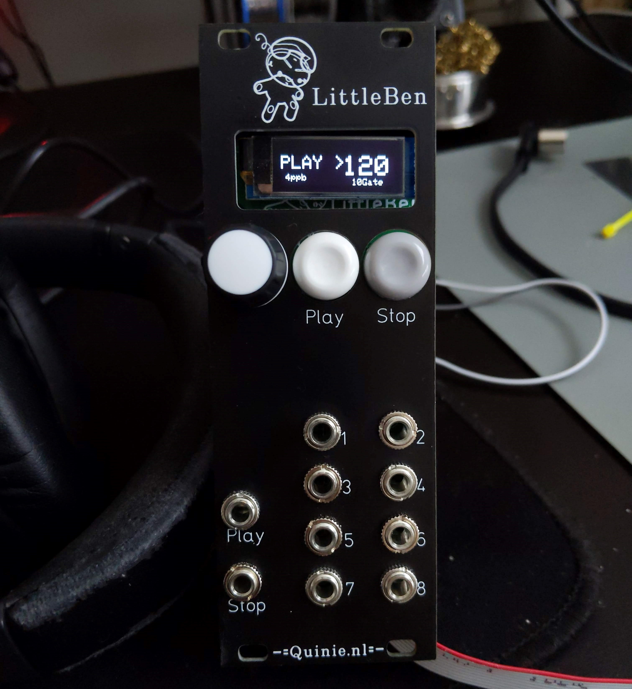
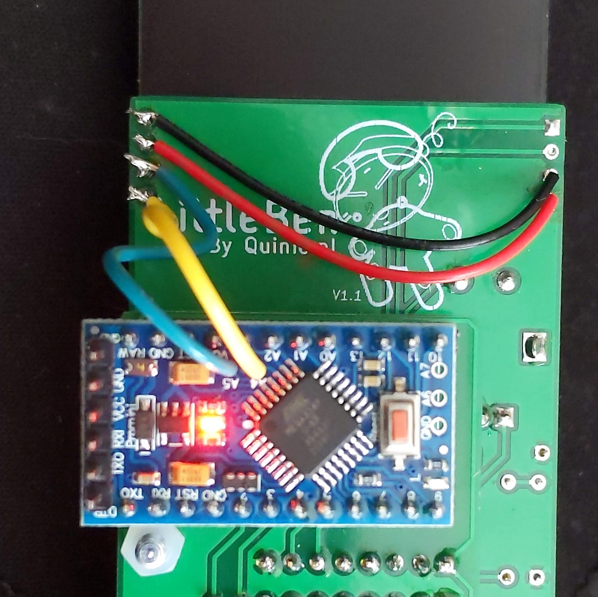
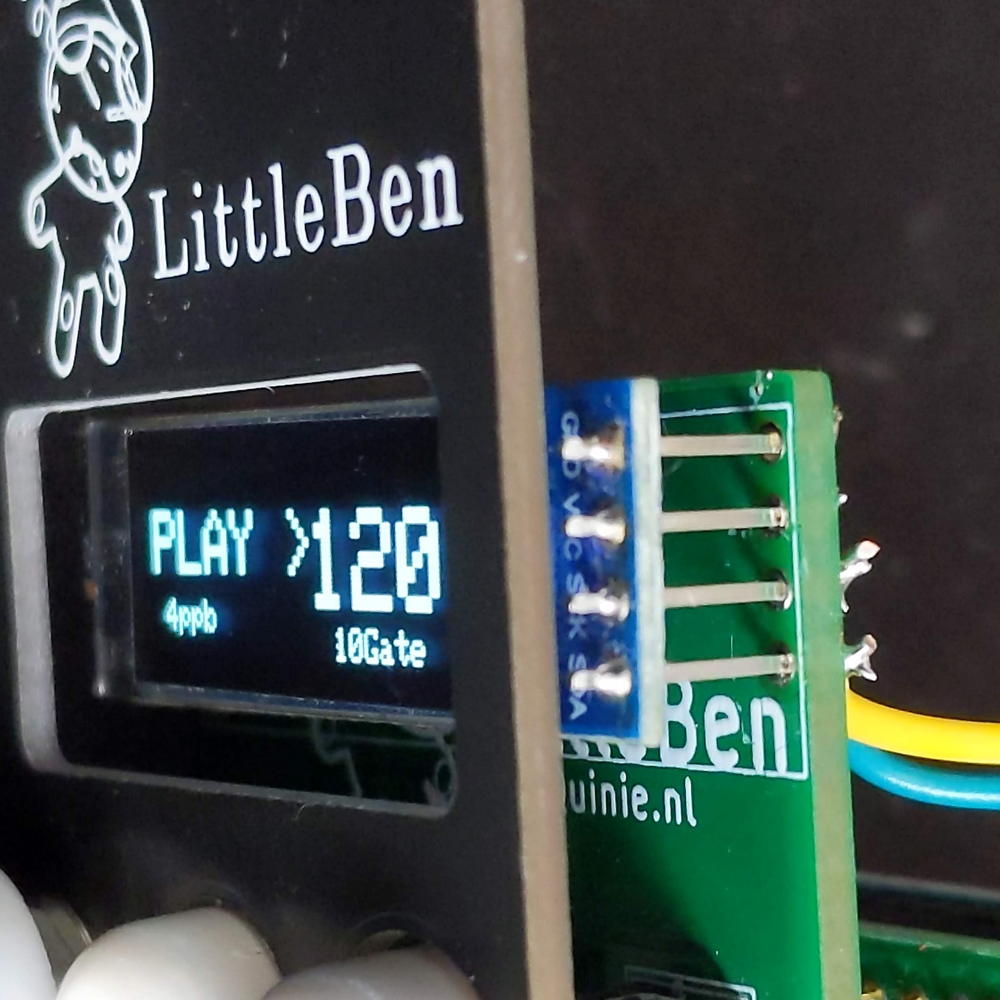

# Litte Benny
Alternative fw for modified LittleBen Eurorack module by [Quinie](https://www.quinie.nl/). 

## HW Mod
I changed the 7 segment display for an OLED 128x32 display. Since the I2C Pins are not used by the original design. It was easy to route them to the display. For the modification, 
- Remove (or do not solder) the 7 segment display. 
- Use the left side of pins that are not connected to attacht the display to the pcb. I recomend to remove the plastic holder of the header pins to level down the Display so it doesnt touch the Front Panel.
- Connect the Power/GND to the PCB. _Attention!_ some OLED displays have a diferent pinout (`Vcc-GND-SCL-SDA` or `GND-Vcc-SCL-SDA`). Bear that in mind.
- Connect the I2C to the Arduino. Pin `A5` to `SCL` and `A4` to `SDA`.

<!--  -->

## Operation
The main function of the module is to be used as a main clock with fix divided outputs (multiples of 1/2).There are 3 variables that can be changed: _BPM_ (beats per minute), _ppb_ (pulses per beat) and _Gate lenght_.
 
 The other Jacks are a 1/2 devision of the main clock as follow:
 - Jack 7: 1/1 of the main clock pulses
 - Jack 5: 1/2 of the main clock pulses
 - Jack 3: 1/4 of the main clock pulses
 - Jack 1: 1/8 of the main clock pulses
 - Jack 8: 1/16 of the main clock pulses
 - Jack 6: 1/32 of the main clock pulses
 - Jack 4: 1/64 of the main clock pulses
 - Jack 2: 1/128 of the main clock pulses
 
 The beat period depends on the ppb and BPM. for example:
 BPM = 120, ppb = 4, the beat period is 1/8 of a second, at Jack 7 And 16 seconds at Jack 2,  (1/16s Up, 1/16 Down)
 
 The Max Gate lenght will be the same as the beat period.(50% duty cycle).
 For the maxium settings (BPM = 240, ppb = 8), that would be 31ms. For a trigger-like behaviour, the gate lenght can be set to the minimum. 
 
## Usage

- **Play** Button will toggle between _PLAY_ and _PAUSE_ states. In _Pause_ the outputs will be clear (after the gate/trigger time) but the _counter_ will remain on hold till _Play_ state is resumed.
- **Stop** Button will reset counter and stop outputs.
- **Encoder**: Pressing the encoder will highlight with an arrow ">" the value that can be changed with the encoder, cycling from BPM > bbp > Gate lenght. 

## ToDos

- Increase Gate lenght to more than 50% duty cycle
- Display outputs clock (O_C style)
